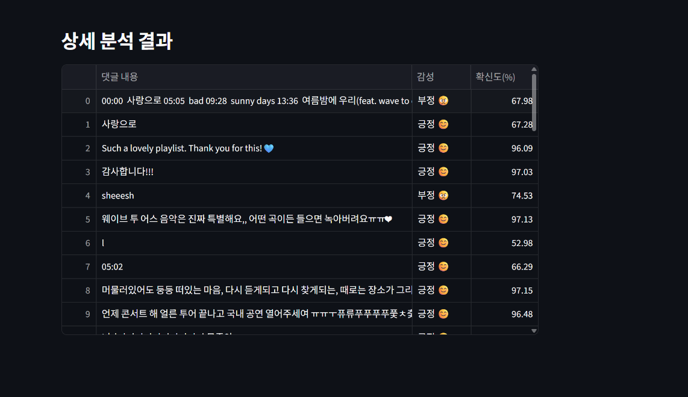

# 🎬 Tube-Insight: 유튜브 댓글 감성 분석기

### 👤 개발자 정보
- 이름: [김지창]
- 학번: [202434743]
- 역할: 데이터 수집 및 감성 분석 AI 모델링, Streamlit 웹 대시보드 구현

---

## 1. 프로젝트 개요 (Project Overview)
이 프로젝트는 **오픈소스 AI 모델(Hugging Face)**을 활용하여 유튜브 영상의 댓글을 자동으로 수집하고, 시청자들의 반응이 긍정적인지 부정적인지 분석하여 시각화해주는 도구입니다.

일일이 댓글을 읽지 않아도 영상의 여론을 한눈에 파악할 수 있도록 돕습니다.

## 2. 사용 기술 (Tech Stack)
- **Language:** Python 3.9
- **Web Framework:** Streamlit (웹 대시보드 구현)
- **AI/NLP:** - `transformers` (Hugging Face 라이브러리)
  - `matthewburke/korean_sentiment` (한국어 감성 분석 Pre-trained 모델)
- **Data Collection:** `youtube-comment-downloader`
- **Visualization:** `pandas`, `streamlit charts`




## 3. 설치 및 실행 방법 (How to Run)


### 사전 요구 사항 (Prerequisites)
파이썬 환경에서 아래 라이브러리들을 설치해야 합니다.

```bash
pip install streamlit transformers torch youtube-comment-downloader pandas sentencepiece


